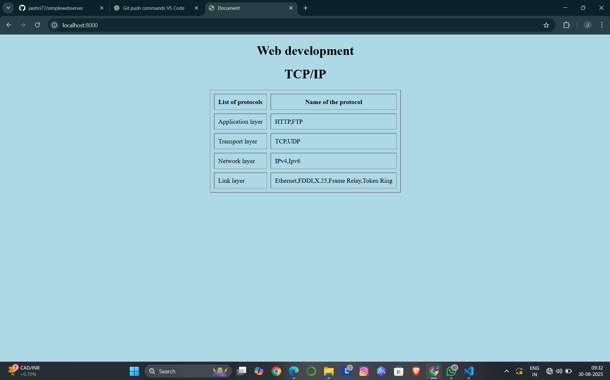

# EX01 Developing a Simple Webserver
## Date:30/08/25

## AIM:
To develop a simple webserver to serve html pages and display the list of protocols in TCP/IP Protocol Suite.

## DESIGN STEPS:
### Step 1: 
HTML content creation.

### Step 2:
Design of webserver workflow.

### Step 3:
Implementation using Python code.

### Step 4:
Import the necessary modules.

### Step 5:
Define a custom request handler.

### Step 6:
Start an HTTP server on a specific port.

### Step 7:
Run the Python script to serve web pages.

### Step 8:
Serve the HTML pages.

### Step 9:
Start the server script and check for errors.

### Step 10:
Open a browser and navigate to http://127.0.0.1:8000 (or the assigned port).

## PROGRAM:
'''
<!DOCTYPE html>
<html lang="en">
<head>
    <meta charset="UTF-8">
    <meta name="viewport" content="width=device-width, initial-scale=1.0">
    <h1>Web development</h1>
    <title>Document</title>
    <link rel="stylesheet" href="index.css">
</head>
<body bgcolor="lightblue">
    <h1>TCP/IP</h1>
   
    <table border="1px" align="center" cellspacing="10px" cellpadding="10px">
        <tr>
            <th>List of protocols</th>
            <th>Name of the protocol</th>
            
            </tr>
            <tr>
                <td>Application layer</td>
                <td>HTTP,FTP</td>
              
                </tr>
            <tr>
                <td>Transport layer</td>
                <td>TCP,UDP</td>
                
            </tr>
            <tr>
                <td>Network layer</td>
                <td>IPv4,Ipv6</td>
                
            </tr>
            <tr>
                <td>Link layer</td>
                <td>Ethernet,FDDI,X.25,Frame Relay,Token Ring</td>
                
            </tr>
</body>
</html>'''

## OUTPUT:

## RESULT:
The program for implementing simple webserver is executed successfully.
